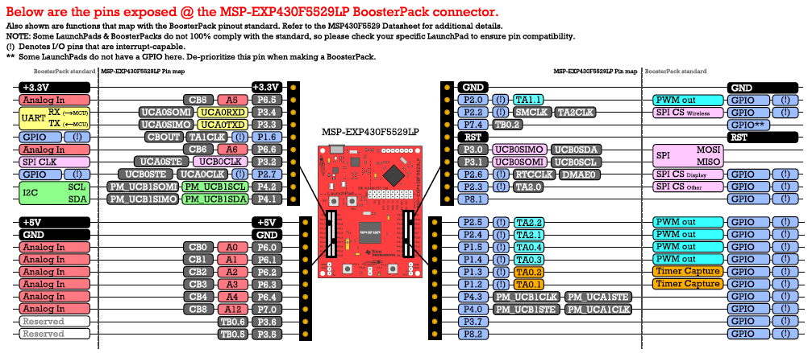
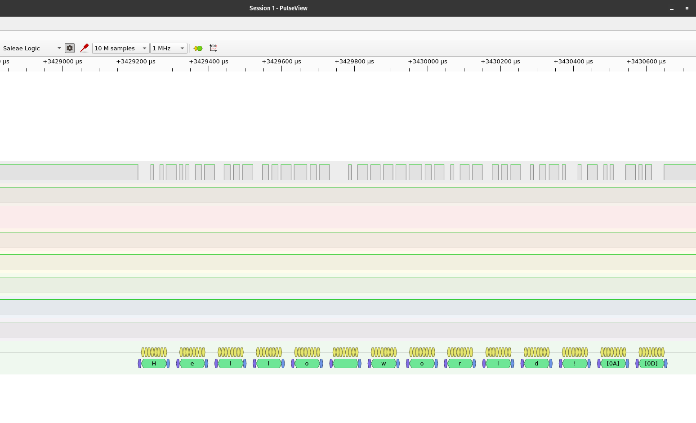
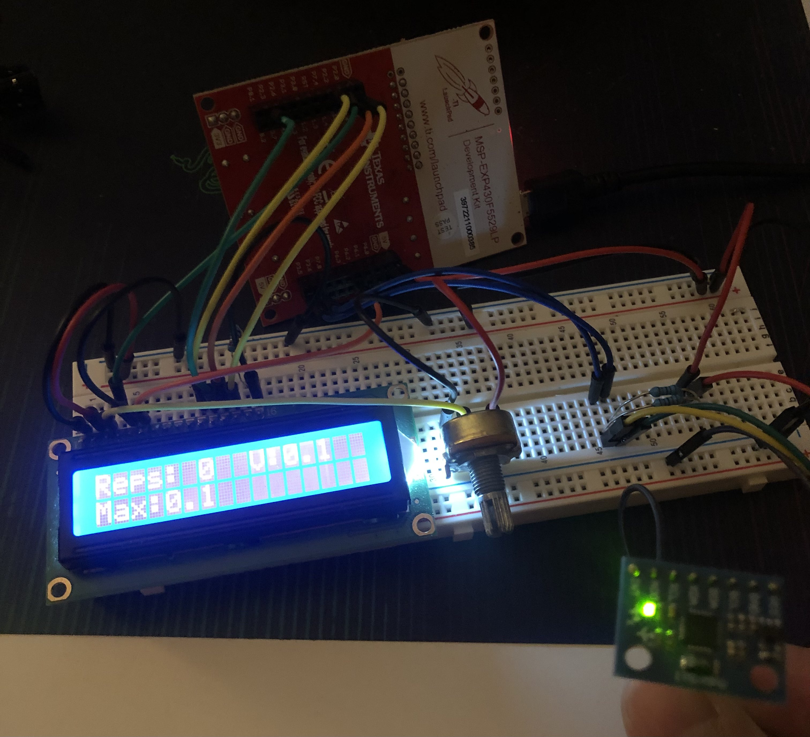

# barbell-tracker

A proof-of-concept barbell device to track velocity, acceleration, and power using an MSP430F5529LP development board and an MPU6050 module.

[This link](https://www.strongerbyscience.com/complete-guide-to-bar-speed-trackers/) is an example of what I am trying to achieve. A barbell tracker is a useful device to get the most out of your athletic performance based training. I would be using this for Olympic Weightlifting with heavy squats, snatches, and clean & jerks.

## Learning Outcomes
- Communication over I2C
- Peripherals (16x2 LCD and MPU6050)
- Debugging with UART

## Hardware
- MSP430F5529LP
- MPU6050
- 16x2 LCD
- Logic analyzer (for debugging)
- Breadboard 
- Jumper wire, resistors

### MSP430F5529 Launchpad

## Breakdown
- MPU6050 takes in signal over I2C
- Calculate velocity, and rep detection and keep track of max velocity per rep
- Display metrics on LCD

## Debugging over UART
Getting everything working in one go is impossible for anyone at my level of study. I am debugging with a logic analyzer using PulseView to view the sent characters/strings/ints over UART.

### PulseView settings

- Add protocol decoder (yellow and green waves icon) and select UART
- 8 data bits, no parity, 1 stop bit

## Final Product

And here we've got the final product. I tested it with some reps doing barbell squats as a bit of rehab as I get back into the gym after breaking my elbow. Hopefully I can refine this design at a later date when I am also healthier to get some rigorous testing with heavy squats, snatches, and clean & jerks. Ideally, I think I would use one of those designs that has the wire attached to the bar, with the main device on the ground. But I think I will leave that for another time.
